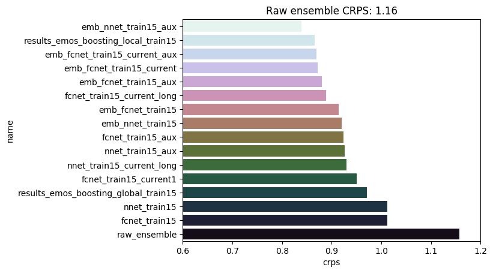

# Post-processing with neural networks

This repository provides Python and R code accompanying the paper 

> Rasp, S. and Lerch, S. (2018).
> Neural networks for post-processing ensemble weather forecasts.
> available at https://arxiv.org/abs/1805.09091

In particular, code for data retrieval and processing as well as implementation and evaluation of benchmark and network models is available. 

This study demonstrates how neural networks can be used for post-processing of ensemble weather forecasts in a distributional regression framework. The neural network models significantly outperform state-of-the-art post-processing techniques while being computationally more efficient. The main advantages of using neural networks include the capability of capturing nonlinear relations between arbitrary predictors and distribution parameters without having to specify appropriate link functions, and the ease of adding station information in a global model by using embeddings.

## Data

The data needed to reproduce the results can be found here: 

> Rasp, Stephan (2020): Interpolated PPNN data. figshare. Dataset. https://doi.org/10.6084/m9.figshare.9762980.v1

### Forecasts

**ECMWF forecasts from TIGGE dataset**

https://software.ecmwf.int/wiki/display/TIGGE/Models

- Variables: T2M and various additional predictors
- Time period: 2007-01-02 -- 2017-01-02 (forecasts for forecast initializations between 2007-01-01 and 2016-12-31)
- Forecast initialization time: 00UTC
- Members: 50
- Forecast lead time: 36h and 48h (valid at 12 and 00UTC)
- area: -10E to 30E; 30N to 70N (large part of Europe centered around Germany)
- resolution: 0.5 degrees

### Observations

**DWD SYNOP stations**

- Number of stations: 537
- Variables: T2M (longitude, latitude and altitude for each station)

## Post-processing

All models are estimated based on two training datasets based on data from year 2015 only, and from years 2007--2015.

### Benchmark models

- standard EMOS models estimated globally and locally
- local EMOS model with gradient boosting to include additional predictors
- local quantile regression forest model

The implementations are available in the directory: `benchmark_postprocessing_models`.

### Network models

- fully connected linear network models
    - including auxiliary predictors
    - including station embeddings
    - including both auxiliary predictors and station embeddings
- neural network models with one hidden layer
    - including auxiliary predictors 
    - including both auxiliary predictors and station embeddings
    
All network models are estimated by minimizing the CRPS using stochastic gradient descent. Implementations are available in the directory: `nn_postprocessing`.

<!-- 
- Minimize CRPS using Stochastic Gradient Descent (or more sophisitcated method in the future)
- In the future: Add more predictor variables
	- Start with more variables at each station, such as wind, humidity (need to think about this in detail.)
	- Add neighborhood information from the ensemble

| Method | Description | CRPS for 2016 |
| ------ | ----------- | ------------- |
| EMOS network (global with rolling window as in standard EMOS) | A network mimicking what EMOS does. | 1.00 |
| EMOS network (train 2015, predict 2016) | | 1.01 |
| Fully connected linear network | 6 parameters | 1.01 |
| Hidden layer neural net | | 1.02 | 
| Hidden layer neural net with station embedding | | 0.91 | 
| Hidden layer neural net with auxiliary data | | 0.94 |
| Hidden layer neural net with embeddings and aux data | | 0.86 |  

## Results

-->

## Overview of results

Models with values in parentheses are not included in the paper. Detailed results and code for forecast evaluation is available in the directory: `results`.

### Training 2015 only

| Model        | variant         | CRPS  | computation time (minutes) |
| :--- |:-------------| :-----:| :-----:|
| EMOS  | global          | 1.01 | 0.03 |
|       | (global, window)| (1.00) | (3) |
|       | local           | 0.90 | 0.1 |
|       | (local, window) | (0.90) | (10) |
| EMOS + boosting | local | 0.85 | 14 |
| QRF   | local           | 0.95 |  8 |
| ---   | ---   | --- |  --- |
| Linear network | fc     | 1.01 | 0.2 |
|       | fc_aux          | 0.92 | 0.7 |
|       | fc_emb          | 0.91 | 0.8 |
|       | fc_aux_emb      | 0.88 | 0.8 |
| Neural network | nn_aux_emb | 0.82 | 9 |

### Training 2007-2015

| Model        | variant         | CRPS  | computation time (minutes) |
| :--- |:-------------| :-----:| :-----:|
| EMOS  | global | 1.00 | 0.3 |
|       | (global, window) | (1.00) | (12) |
|       | local | 0.90 | 1 |
|       | (local, window) | (0.88) | (45) |
| EMOS + boosting | local  | 0.80 |  48 |
| QRF   | local   |  0.81 | 430  |
| ---   | ---   | --- |  --- |
| Linear network | fc     | 1.01 | 1 |
|       | fc_aux          | 0.91 | 2 |
|       | fc_emb          | 0.91 | 3 |
|       | fc_aux_emb      | 0.87 | 3 |
| Neural network | nn_aux | 0.87 | 25 |
|  | nn_aux_emb | 0.78 | 16 |

